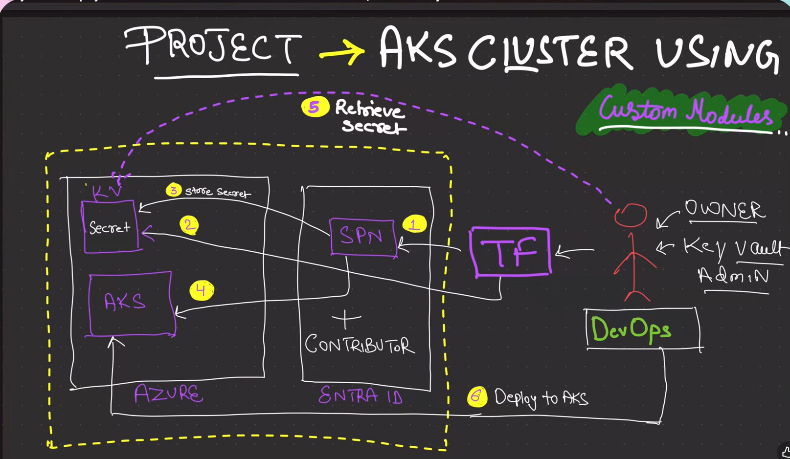

### This repo will have the details about AKS

    * From the above image we can see that we are using a service principle to create the azure key-vault and the aks cluster as well

    * Service Principle is created with azuread not the azurerm, but here in kodekloud playground we are using the normal user other than service principle.

    * 