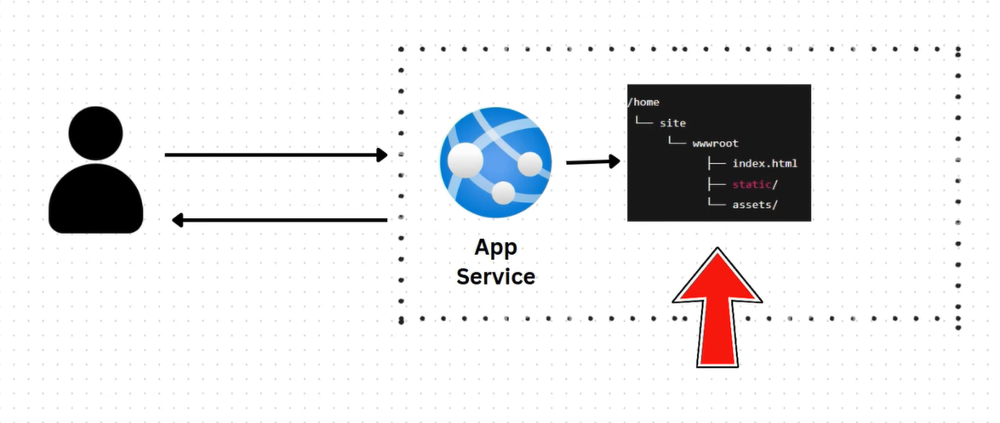
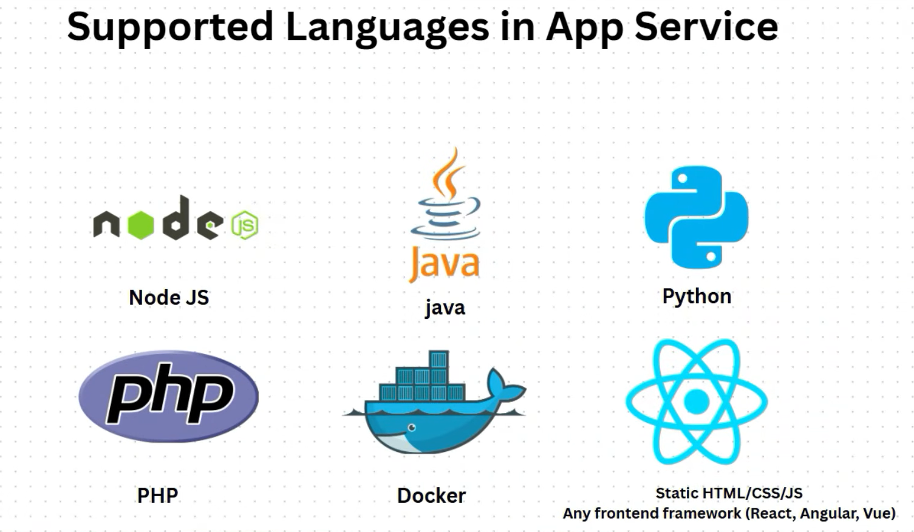
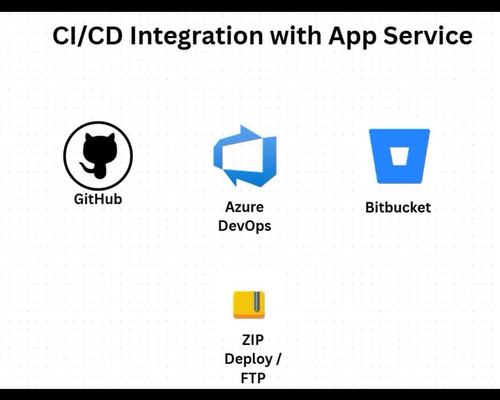
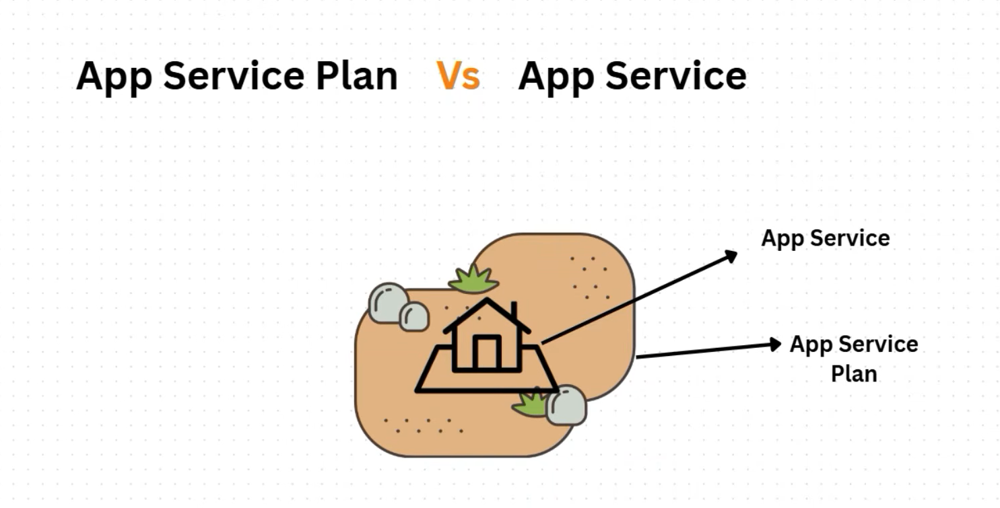

### This repo contains the details about Azure App Service

https://www.youtube.com/watch?v=--tNqPxZKp8&t=176s  -- small explanation

## Understanding Azure App Service

    * AAS is a PAAS offered by Azure, where we can host our applications directly on an AAS where the underlying things were taken care by Azure in the background.

    * If we are deploying a fullstack application and its concerned frontend can be hosted on the AAS and its url or ip can be given to end users.

    * As shown in the above directory structure, the application is stored in our AAS and served to users via the AAS public DNS and all these are tied to and managed by something called App Service Principle.

    * The complete underlying things like networking, computing etc will be taken care by ASP.

    * Above are the languages supported by APS.

    * As shown in the above picture we can integrate the AAS with them and deploy our applications.

    * From the above image we can understand tht the ASP provides the required infra for the AAS to host our applications.

