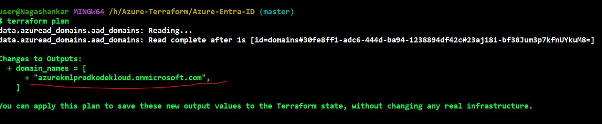

### This is repo is to understand the Azure Entra-ID

https://registry.terraform.io/providers/hashicorp/azuread/latest/docs/data-sources/domains

### understand how Entra-ID works

    * Azure is a full public cloud computing platform, while Azure Active Directory (now renamed Microsoft Entra ID) is a specific cloud service for managing user identities and log-in access. Azure provides virtual computers, databases, and networks, whereas Azure AD handles passwords, multi-factor security, and sign-ins for apps like Microsoft 365

    * We initialize this repo using the azuread rather than azurerm.

    * Using the main.tf in this folder we try to list the domains existing in our current subscription plan.

    * From the above image we can undertand that a domain is present in our current subscription plan.

    * Even if we mention 0 in the place of * in main.tf it results only the same domain in the form of simple variable where as if has returned a list when we used * 

    * From the above image we can understand that the usernames are getting printed as we have decoded our users.csv file and the domain is prented two times because we have used output two times in main.tf

    